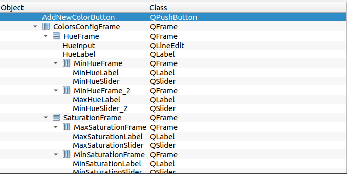

# NGW

NGW stands for New Game Window, created to replace the previous version based on the following justifications:

- The old software is visually inefficient, utilizing few resources of QT and the ones it uses are used frivolously.
- The old software is a significant impediment to the team's development, being poorly documented, poorly written, and poorly understood by the team members themselves.
- Extensive bugs that lead to constant freezes and crashes for unknown reasons or reasons that should not cause crashes.
- Actions that should work but do not, such as reading and writing to files, serial ports, among others.

## Core Features

- Eficient
- Performatic
- Documented
- QT 6

## Documentation

- [Basics](#basics)
- [Design Goals](#design-goals)
 - [Programming Patterns](#programming-patterns)
 - [Visual Elements](#visual-elements)
 - [Colors](#colors)
- [MainWindow](#mainwindow)
    - [Design](#design)
    - [Icons semantics](#icons-semantics)
- [Camera Section](#camera-section)
    - [Function](#camera-function)
    - [Visuals](#camera-visuals)
- [Robots Section](#robots-section)
    - [Function](#robots-function)
    - [Visuals](#robots-visuals)
- [Colors Section](#colors-section)
    - [Function](#colors-function)
    - [Visuals](#colors-visuals)
- [Perspective Section](#perspective-section)
    - [Function](#perspective-function)
    - [Visuals](#perspective-visuals)
- [Filters Section](#filters-section)
    - [Function](#filters-function)
    - [Visuals](#filters-visuals)
- [Game Section](#game-section)
    - [Function](#game-function)
    - [Visuals](#game-visuals)


## Design Goals

- ## Programming Patterns

    ### Signals
    Signals are events emitted by objects when something happens. These events can be button clicks, changes of state in widgets, etc. When a signal is emitted, it notifies all the connected "slots" so that they can react to this event. Signals are declared using the signals: macro in the definition of a class derived from QObject.

    ```c++11
    //PushButton Click event example
    connect(ui->cancelButton, &QPushButton::clicked, this, &AddNewColor::on_cancel_button_pressed);
    ```

    Functions that receive signals and process information or modify some application state should always be declared using snake_case.
    ```c++11
    //Signals functions examples
    void on_camera_btn_clicked();
    void on_select_colors_btn_clicked();
    void on_add_new_color_btn_clicked();
    ```

    Otherwise, functions that represent signals themselves should be declared using camelCase.

    ```c++11
    //Signals themselves functions examples
    void cancelButtonPressed();
    void confirmedButtonPressed();
    ```

    ### Functions
    The rest of the functions in the code should always follow camelCase.
    ```c++11
    //Auxiliary function of the code
    void setCallbacks();
    ```

    ### Widgets
    In Qt Creator, a "widget" is a graphical component that is part of the user interface of a Qt application. Widgets are fundamental building blocks for creating rich and interactive graphical interfaces. They can range from simple buttons to complex and customized windows.

    I have not established a well-defined naming pattern for Widgets both within the code and in QT Designer. I suggest keeping the name within the context that the widget represents and within its functionality, but I generally suggest using PascalCase

    

    
    

- ## Colors

    - Background
    <kbd style="background-color: #333138; color: white; padding: 5px;">
        #333138
    </kbd>


    - Text
    <kbd style="background-color: white; color: black; padding: 5px;">
        #ffffff
    </kbd>

    - Buttons
    <kbd style="background-color: #FF312E; color: white; padding: 5px;">
        #FF312E
    </kbd>


## Colors Section

- ## Colors Function
    This page is used to create new colors, edit existing colors before the game, factors such as lighting can influence these aspects.

- ## Colors Visuals
    Essa página modifica bastante a antiga página de cores, ela é mais auto contida, o workflow dela é diferente, aprimorado para ser mais eficiente e necessitar menos trabalho para funcionar.

    

## Doubts

One of the major issues with the old Game Window's functionality was the lack of documentation regarding its own bugs and existing problems. This is expected to be addressed in this new implementation; however, as no software is exempt from them, this implementation may also have some bugs. As I am yet unsure where to document them, I will leave it open for now. Nonetheless, two possibilities come to mind: documenting the errors via Trello or documenting the errors directly here on Github.